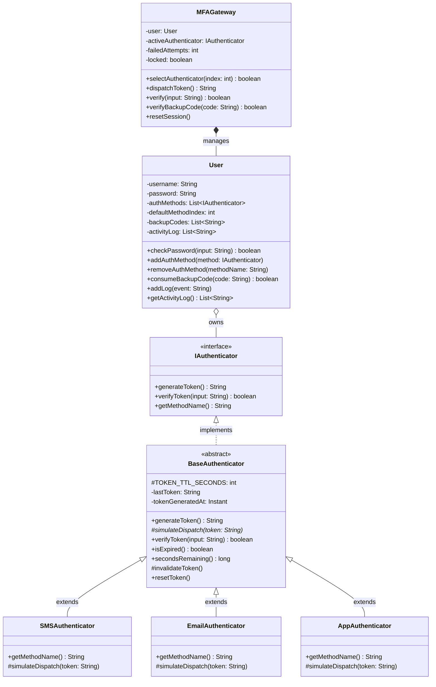
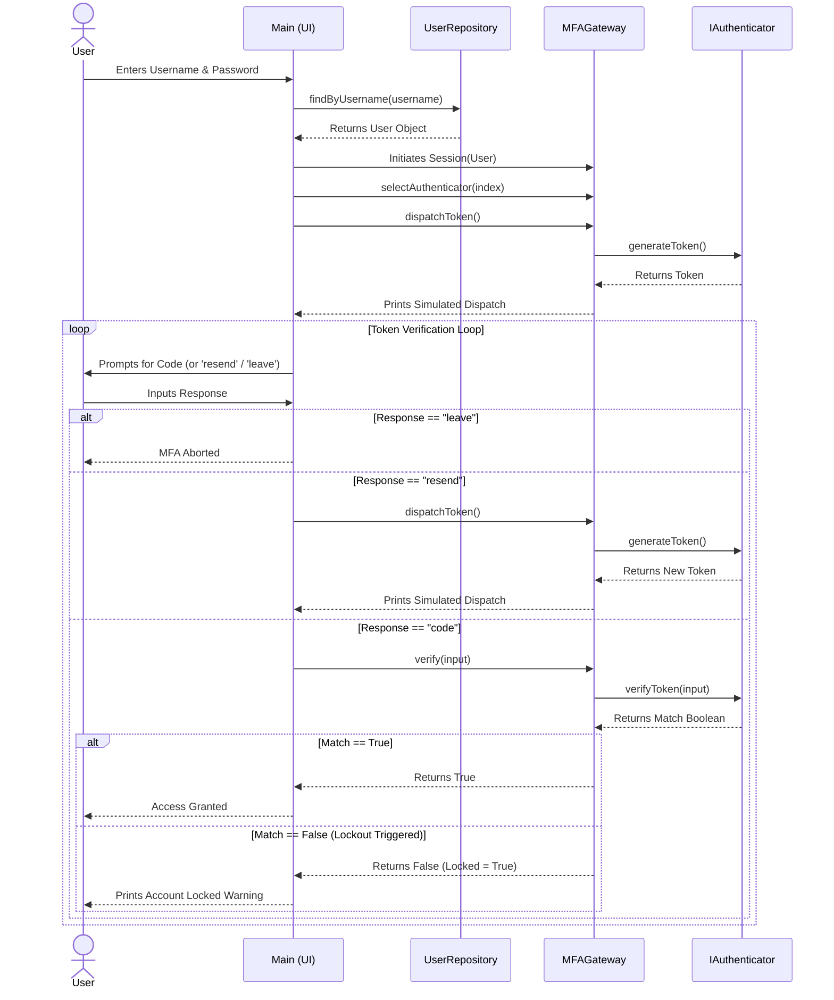
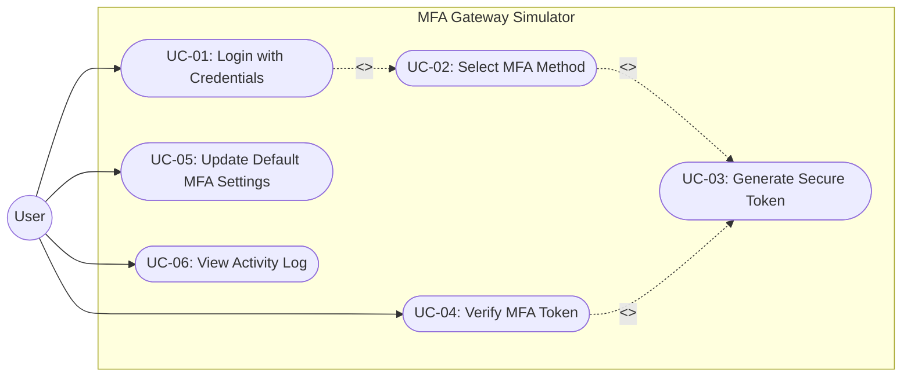

# Multi-Factor Authentication (MFA) Gateway Simulator

**Date of Submission:** May 7 2026  
**Github URL:** [(https://github.com/TangelinaWu/OOP-Final-Project)]   

### 👥 Team Members 

| Student 1 | Student 2 | Student 3 |
|-----------|-----------|-----------|
| Yifan Zuo | Angelina Wu | Zheqi Zhang |

---

## 1. System Analysis

### General Description, Goals, and Benefits
This project is an Object-Oriented simulation of a Multi-Factor Authentication (MFA) gateway. The primary goal is to demonstrate robust backend security architecture balanced with a seamless user experience. The system models how users interact with different verification methods (Email, SMS, Authenticator App), allowing them to dynamically select their preferred method during login, securely update their MFA preferences, and view their recent activity within a profile dashboard. 

The main benefit of this system is its modularity; by utilizing the Strategy Design Pattern, new authentication methods can be added to the gateway without altering the core login logic or session management.

### Special Requirements & Constraints
* **Language:** Java (JDK 17+)
* **Interface:** Command-Line Interface (CLI)
* **Constraints:** Must operate without an external database (utilizes an encapsulated in-memory `UserRepository` for simulation).
* **Reliability:** Enforces strict state management. Users are locked out after 3 failed token attempts and must utilize secure backup recovery codes.

---

## 2. Set up & Run 

1. Clone this repository to your local machine.
2. Navigate to the `src` directory:
   ```bash
   cd src
3. Compile the Java files: javac *.java
4. Run the application: java Main

5. Pre-Seeded Demo Accounts & Testing Flow
You can test the system's dynamic routing, 30-second token expiration, and lockout features using these accounts:

Account 1: Alice
Username: alice | Password: password123
Configured Methods: Email, SMS, Authenticator App
Backup Recovery Codes: BACK-1111, BACK-2222, BACK-3333

Account 2: Bob
Username: bob | Password: securepass
Configured Methods: SMS only
Backup Recovery Codes: BACK-9999

Test Scenarios to Try:
    1. Log in, select a method, input the exact generated token, and access the profile dashboard to view the Activity Log.

    2. Log in, request an Authenticator App token, wait 31 seconds, and attempt to use it. Type resend to get a new code.

    3. Deliberately fail the verification 3 times to trigger an account lock. Input a Backup Recovery Code to regain access.

## 3. System Design (UML)

    A. Class Diagram
This diagram details the static structure of the system, highlighting the polymorphic `IAuthenticator` interface, the `BaseAuthenticator` abstract class managing token expiration, and the strict encapsulation of the `User` state.



    B. Sequence Diagram
    This diagram illustrates the dynamic object interaction during a successful login and token verification event, including the verification loop and lockout conditions.



    C. Uses Cases Diagram 
    This outlines the boundaries of the simulator and the actions available to the user from the CLI.



     Uses Cases Description 


| UC Ref | Name | Overview | Related Use Cases | Actors |
|--------|------|----------|-------------------|--------|
| UC-01 | Login with credentials | The user enters their username and password via the CLI. The system validates credentials against the in-memory UserRepository. On success, an MFA session is initiated. | includes UC-02 | User |
| UC-02 | Select MFA method | After a successful primary login, the system presents the user's configured verification methods (Email, SMS, Authenticator App). The user selects their preferred method for the current session. | includes UC-03 | User, MFAGateway |
| UC-03 | Generate secure token | The MFAGateway triggers the selected IAuthenticator to generate a one-time token with a 30-second TTL. The system simulates dispatch (e.g., "Token 4920 sent via SMS") and begins the expiration timer. | Extended by UC-02, UC-04 | MFAGateway, IAuthenticator |
| UC-04 | Verify MFA token | The user submits their token code. The system verifies it against the active token within the TTL window. Three consecutive failures trigger an account lockout; the user may also resend or use a backup recovery code. | includes UC-03 | User, MFAGateway |
| UC-05 | Update default MFA settings | From the profile dashboard, the user can add new verification methods, remove existing ones, or change their default primary MFA method. Changes are persisted to the in-memory User object for the session. | — | User |
| UC-06 | View activity log | From the profile dashboard, the user can view a chronological log of recent authentication events (logins, method changes, failed attempts, lockouts) stored in the User object's activity log. | — | User |